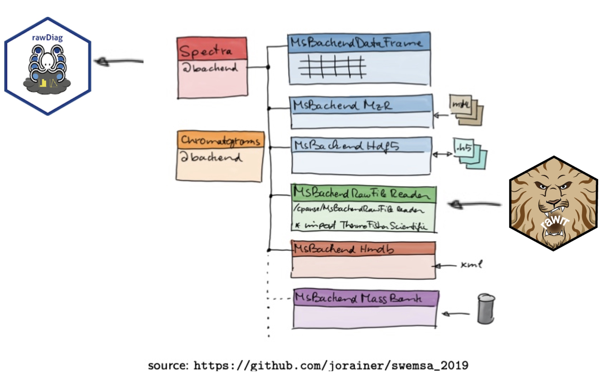

```{r setup, include=FALSE}
knitr::opts_chunk$set(echo = TRUE, message = FALSE, eval=TRUE)
```

# Functional Genomics Center Zurich 

# Where we are? 

47N 008E

## Who we are? 

# {data-background=graphics/fgcz-context.jpg data-background-size=cover}

# {data-background=https://fgcz.ch/the-center/people/_jcr_content/par/fullwidthimage/image.imageformat.lightbox.1823392634.jpg data-background-size=cover}


## What are we providing?
Service, training, tailored R&D in the area of:

- Genomics
- Metabolomics
- Proteomics

## How do we use R in our core facility?

- Quality control 
- LC-MS method optimization
- Statistics and visualization
- Automatic report generation

### DISCLAIMER
In **proteomics**
we do **NOT** use R for identification and quantification
(no LC-MS feature finding) tasks.

<div class="note">
here we use mascot, comet, MaxQuant, MS-FRAGGER, Spectronaut ...
</div>


## Orbitrap run statistics
At the FGCZ we generate ~20K Orbitrap runs per year:
```{r numberRuns, fig.retina=3, echo=FALSE}
S<-data.frame(year = c(2012:2020),
           all = c(12295, 15982, 15190, 16726, 19251, 24588, 28814, 30531, 27176),
           clean = c(881, 1788, 1700,  2228, 2121, 2965, 4097, 6677, 6529),
           qc = c(1952,  3326, 2542,2821, 4027, 4435, 5640, 5247, 3761))

plot(all ~ year, data=S, pch=16, type='b', lwd=2, ylim=c(0,max(S$all)), xlim=c(2012,2020), ylab='number of runs'); lines(S$qc ~ S$year,type='b', col='red'); lines(S$clean ~ S$year,type='b', col='green'); legend("topleft", c('all', 'qc', 'clean'), pch=16, col=c('black', 'red', 'green')); box(); lines(S$all-(S$qc +S$clean) ~ S$year,type='b', col='blue');
```

while operating up to 15 Orbitrap-based LC-MS systems.

<div class='notes'>
|year  |  2012|  2013|  2014|  2015|  2016|  2017|  2018|  2019|  2020| 2021|
|:-----|-----:|-----:|-----:|-----:|-----:|-----:|-----:|-----:|-----:|----:|
|all   | 12295| 15982| 15190| 16726| 19251| 24588| 28814| 30531| 27176| 6261|
|clean |   881|  1788|  1700|  2228|  2121|  2965|  4097|  6677|  6529| 1449|
|qc    |  1952|  3326|  2542|  2821|  4027|  4435|  5640|  5247|  3761|  820|

</div>

## Outline

- Example LC-MS data
- R package `rawDiag`
- R package `rawrr`
- Integration into the Bioconductor ecosystem
- Questions

# Example LC-MS data 

## Download example data from MassIVE {.build .smaller}

[MassIVE MSV000086542](https://massive.ucsd.edu/ProteoSAFe/dataset.jsp?task=575538e190e84cbfbf6c17aa1219e403)

* Sample consists of the iRT peptide mix (Biognosys) in a tryptic BSA digest.
* Data was recorded on a Q Exactive HF using PRM on 20 min linear gradient.

Download via FTP and cache on your local disk

```{r download, echo=TRUE, message=FALSE, eval=TRUE}
f <- "ftp://massive.ucsd.edu/MSV000086542/raw/20181113_010_autoQC01.raw"
cachedir <- tools::R_user_dir("rawrr", which = "cache")
rawfile <- file.path(cachedir, basename(f))
if (!dir.exists(cachedir)) { dir.create(cachedir, recursive = TRUE) }
if (!file.exists(rawfile)) { download.file(f, rawfile) }
(rawfile)
```


# rawDiag

```{r, echo=FALSE, out.width="25%"}
knitr::include_graphics("https://raw.githubusercontent.com/fgcz/rawDiag/R4/inst/shiny/bfabric_rawDiag/www/octopussy.png")
```

## rawDiag package basics

https://github.com/fgcz/rawDiag

**rawDiag: An R Package Supporting Rational LC–MS Method Optimization for Bottom-up Proteomics**  
J. Proteome Res. 2018, 17, 8, 2908–2914

https://pubs.acs.org/doi/10.1021/acs.jproteome.8b00173

LC-MS example data

[MassIVE MSV000082389](https://massive.ucsd.edu/ProteoSAFe/dataset.jsp?task=b231e78d674345798ebe50e46a9a3a93)

## Initial Motivation

- RawMeat software (Vast Scientific) based on Thermo MSFileReader library

```{r, echo=FALSE, out.width="35%"}

```

but...

## Functionality

* Diagnostic visualization of **metadata**
  + Using state-of-the-art graphics system(s)
  + Programmatic usage (for reporting or scientific publications)
  + Interactive usage (GUI-based)
* Works for BIG raw file sets
* Applicable to all current (future) Thermo instrument models
* Bypasses the need for file conversion to HUPO PSI formats
* Eliminates copying data to local scratch spaces
* Web application
* Connection to FGCZ data management system [b-fabric](https://fgcz-bfabric.uzh.ch/bfabric/)


## Package layout

```{r, echo=FALSE, out.width="100%"}

```

## Package Cheatsheet

```{r, echo=FALSE, out.width="100%", fig.align="center"}

```

## Installation

We **strongly** encourage to use our latest GitHub release from

https://github.com/fgcz/rawDiag/releases/

```{r eval=FALSE, echo=TRUE}
install.packages('http://fgcz-ms.uzh.ch/~cpanse/rawDiag_0.0.41.tar.gz', repo=NULL)
```

### Installation requirements

- Microsoft Windows: .NET framework >4.8
- macOS/Linux: [Mono](https://www.mono-project.com/) crossplatform, open source .NET framework

### Issues, Problems, bugs, ...

- Please use GitHub issues for reporting

https://github.com/fgcz/rawDiag/issues

## Test Your Installation  {.smaller}

```{r, message=FALSE, warning=FALSE}
sampleData <- rawDiag::read.raw(file = file.path(system.file(package = 'rawDiag'),
                                                 'extdata', 'sample.raw'))
str(sampleData)
```

## A basic Example  {.smaller}

```{r PlotTicBasepeak, message=FALSE, warning=FALSE}
dd <- rawDiag::read.raw(file = rawfile)
rawDiag::PlotTicBasepeak(dd)
```

## Metadata visualization using ggplot2

```{r, echo=FALSE, out.width="80%", eval=TRUE, fig.align="center"}

```

## A rawDiag Web Application using Shiny

```{r, echo=TRUE, eval=FALSE}
rawDiag_shiny <- system.file('shiny', 'demo', package = 'rawDiag')
shiny::runApp(rawDiag_shiny, display.mode = 'normal')
```

## The rawDiag Web Application @FGCZ

```{r, echo=FALSE}

```

## ABRF PRG 2020 Beer study

```{r, echo=FALSE, out.width="40%"}

```
```{r, echo=FALSE, out.width="40%"}

```

* 60 min DDA (top20, maxIT = 22 ms, R = 15'000, AGC = 1e5) on a Exploris 480  

[b-fabric o23233](https://fgcz-bfabric.uzh.ch/bfabric/order/show.html?id=23233&tab=details)  

[b-fabric rawDiag](http://fgcz-ms-shiny.uzh.ch:8080/bfabric_rawDiag/)

# Questions?

# rawrr 


## Motivation for a new R package {.build}

- `rawDiag` designed for visualization of Orbitrap meta data 

- Now we want to read entire Spectra and Chromatograms!

- The R pkg `rawrr` access the
[New RawFileReader from Thermo Fisher Scientific](https://planetorbitrap.com/rawfilereader)
running on Microsoft Windows|Linux|macOS from R

## `rawrr` package basics

https://github.com/fgcz/rawrr


**The rawrr R Package: Direct Access to Orbitrap Data and Beyond**  
J. Proteome Res. Special Issue: Software Tools and Resources 2021
<div class="red2">
open access
</div>
https://pubs.acs.org/doi/abs/10.1021/acs.jproteome.0c00866

LC-MS example data:
[MassIVE MSV000086542](https://massive.ucsd.edu/ProteoSAFe/dataset.jsp?task=575538e190e84cbfbf6c17aa1219e403)


## Installation

We **strongly** encourage to use our latest GitHub release from

https://github.com/fgcz/rawrr/releases/

```{r eval=FALSE, echo=TRUE}
install.packages('http://fgcz-ms.uzh.ch/~cpanse/rawrr_0.2.5.tar.gz', repo=NULL)
```

### Installation requirements

- Microsoft Windows: .NET framework >4.8
- macOS/Linux: [Mono](https://www.mono-project.com/) crossplatform, open source .NET framework

### Issues, Problems, bugs, ...

- Please use GitHub issues for reporting

https://github.com/fgcz/rawrr/issues


## `rawrr` methods

|Function Name       |Description                                   |
|:-------------------|----------------------------------------------|
|`readFileHeader()`  |Reads meta information from a raw file header |
|`readIndex()`       |Generates a scan index from a raw file        |
|`readSpectrum()`    |Reads spectral data from a raw file           |
|`readChromatogram()`|Reads chromatographic data from a raw file    |

`rawrr` also provides *basic* print and plot methods 

for more information read the manual pages, e.g., `?readSpectrum`.

## Read the raw file header {.smaller}

```{r readFileHeader, echo=TRUE, eval=TRUE}
(H <- rawrr::readFileHeader(rawfile = rawfile))
```

## `rawrr::readIndex` {.smaller}

```{r readIndex}
Idx <- rawrr::readIndex(rawfile = rawfile)
```

```{r}
head(Idx)
```

## Give me all scan having this scan type applied.
```{r}
head(subset(Idx, scanType == "FTMS + c NSI Full ms2 487.2567@hcd27.00 [100.0000-1015.0000]"))
```

## Read a spectrum {.smaller}

```{r readSpectrum0, eval=TRUE, echo=TRUE}
S <- rawrr::readSpectrum(rawfile = rawfile, scan = 9594)
class(S)
class(S[[1]])
summary(S[[1]])
```
```{r}
S[[1]]
```


```{r}
S[[1]]$mZ
```
<div class="notes">
centroid data by instrument definition
<div>

```{r}
S[[1]]$intensity
````

TODO(CP):mgf header listing

## Plot a spectrum {.smaller}
```{r plotrawrrspectrum, fig.cap="Plot of scan number 9594 - LGGNEQVTR++"}
plot(S[[1]], centroid=TRUE)
```

## Orbitrap-specific attributes {.smaller}

<div class="note">
```{r, echo=FALSE, out.width="50%", eval=TRUE}
knitr::include_graphics("https://upload.wikimedia.org/wikipedia/commons/7/70/OrbitrapMA%26Injector.png")
```
</div>

```{r Orbitrap, echo=TRUE, message=FALSE, eval=TRUE}
# automatic gain control
S[[1]]$`AGC Target:`
S[[1]]$`Ion Injection Time (ms)`
S[[1]]$`Max. Ion Time (ms):`
S[[1]]$`FT Resolution:` # Resolving power-related
```


## Determine fragment ions of LGGNEQVTR {.smaller}

```{r}
yIonSeries <- protViz::fragmentIon("LGGNEQVTR")[[1]]$y[1:8]
names(yIonSeries) <- paste0("y", seq(1, length(yIonSeries)))
yIonSeries
```

## Assign the fragment ions {.smaller}
```{r plotSN}
plot(S[[1]], centroid=TRUE, SN = TRUE, diagnostic = TRUE)
abline(h = 5, lty = 2, col = "blue") # S/N threshold indicator
abline(v = yIonSeries, col='#DDDDDD88', lwd=5)
axis(3, yIonSeries, names(yIonSeries))
```

<div class="notes">
an alternative to the code snippet above
```{r peakplot}
protViz::peakplot("LGGNEQVTR", S[[1]], FUN=function(b,y){cbind(y=y)})
```
</div>

## Total ion chromatogram (tic) 
<div class="notes">
calculated from all MS1-level scans.

```{r}
X <- rawrr::readChromatogram(rawfile = rawfile, type = "tic")
str(X)
```
</div>

```{r TIC}
plot(rawrr::readChromatogram(rawfile = rawfile, type = "tic"))
```

## Base peak chromatogram  (bpc)

```{r BPC}
plot(rawrr::readChromatogram(rawfile = rawfile, type = "bpc"))
```


## Extracted ion chromatograms (xic)  {.smaller}


### Define Biognosys iRT peptides {.smaller}

```{r rawrr::readChromatogramXIC}
iRTpeptide <- c("LGGNEQVTR", "YILAGVENSK", "GTFIIDPGGVIR", "GTFIIDPAAVIR",
                 "GAGSSEPVTGLDAK", "TPVISGGPYEYR", "VEATFGVDESNAK",
                 "TPVITGAPYEYR", "DGLDAASYYAPVR", "ADVTPADFSEWSK",
                 "LFLQFGAQGSPFLK")

(iRTmz <- (protViz::parentIonMass(iRTpeptide) + 1.008) / 2)

iRTscore <- c(-24.92, 19.79, 70.52, 87.23, 0, 28.71, 12.39, 33.38, 42.26, 54.62, 100)

names(iRTmz) <- iRTpeptide
names(iRTscore) <- iRTpeptide

iRTmz
iRTscore
```

```{r plotreadChromatogram}
C <- rawrr::readChromatogram(rawfile, mass = iRTmz, tol = 10, type = "xic", filter = "ms")
plot(C, diagnostic = TRUE)
```

## Extracted ion chromatograms for y6, y7, and y8 {.smaller}
<div class="notes">
</div>
```{r fragmentIonTraces}
fC <- rawrr::readChromatogram(rawfile = rawfile,
      mass = yIonSeries[c("y6", "y7", "y8")], type = 'xic', tol = 10,
      filter = "FTMS + c NSI Full ms2 487.2567@hcd27.00 [100.0000-1015.0000]")
plot(fC, diagnostic = TRUE)
```


## Fit linear model {.smaller .build}

```{r iRTscoreFit, error=TRUE, echo=TRUE, out.width="100%"}
rt <- sapply(C, function(x) x$times[which.max(x$intensities)[1]])
fit <- lm(rt ~ iRTscore)
```

<div class="notes">
Plot shows observed peptide RTs as a function of iRT scores and fitted regression line of corresponding linear model obtained by ordinary least squares (OLS) regression.

```{r}
summary(fit)
```
</div>

```{r iRTscoreFitPlot, echo=FALSE, error=TRUE, out.width="70%"}
# iRTscoreFitPlot
plot(rt ~ iRTscore,
     ylab = 'Retention time [min]',
     xlab = "iRT score",
     pch=16,frame.plot = FALSE)
abline(fit, col = 'grey')
abline(v = 0, col = "grey", lty = 2)
legend("topleft", legend = paste("Regression line: ", "rt =",
                                 format(coef(fit)[1], digits = 4), " + ",
                                 format(coef(fit)[2], digits = 2), "score",
                                 "\nR2: ", format(summary(fit)$r.squared, digits = 2)),
       bty = "n", cex = 0.75)
text(iRTscore, rt, iRTmz, pos=1,cex=0.5)
```


## Extension

An extended and dynamic version of the above use cases can be found at (https://fgcz-ms.uzh.ch/~cpanse/rawrr/test/functional_test.html). 

# Next 
Integration into the Bioconductor (R4MassSpectrometry) ecosystem
```{r, echo=FALSE, out.width="25%"}

```

# Thanks

## Session information {.smaller}

```{r sessioninfo, echo=FALSE}
sessionInfo()
```


# Appendix

## Require some tool functions from `protViz`
https://CRAN.R-project.org/package=protViz

```{r install, echo=TRUE, eval=FALSE}
install.packages('protViz')
```

|Function Name       |Description                                             |
|:-------------------|--------------------------------------------------------|
|`parentIonMass()`   |Compute parent ion mass of a peptide sequence           |
|`ssrc()`            |Sequence specific retention calculator                  |
|`fragmentIon()`     |Compute the b and y fragment ions of a peptide sequence |
|`peakplot()`        |Labelling of peptide fragment mass spectra              |


